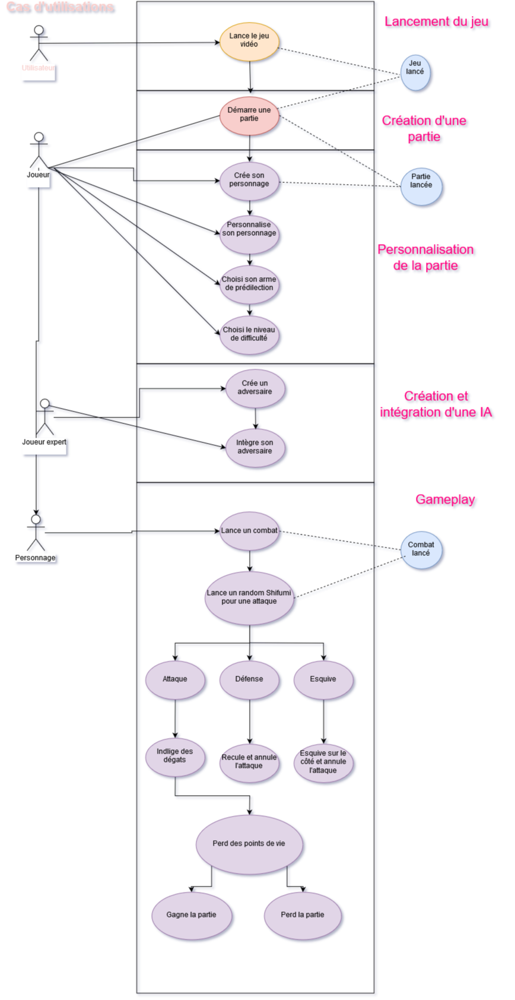

# zifumii

## Réécrire et détailler le cahier des charges 

- Jeu basé sur le système du shi fu mi.
- Jeu tour par tour
- Le joueur joue contre une « IA » 
- Cette IA donne la possibilité pour le joueur de développer des stratégies
- L’IA gère la progression de la difficulté
- Le jouer doit penser que le jeu est juste  (quel est le problème ?)
- Fournir une interface attrayante s’appuyant sur une évaluation UX/UI auprès des étudiants du campus
- Architecture permettant de mettre de nouvelles « IA »
- Etudier le mode de promotion et de commercialisation à (championnat, réseaux sociaux)

## Organisation

- Raimon Dylan
- Molinari David
- Bigot Kevin
- Durando Adrian

## Planning 
  - **Spécification**
    - Le joueur crée son personage pour la partie, il commence niveau 1 avec les stats de base
    - Le joueur à pour but de monter tout en haut de la tour de combat.
    - Le joueur ainsi que les monstres ont des points de vie
    - Un combat ce fait tour par tour
    - Durant son tour le joueur choisit son action (Attaque, Bouclier, Saisir) Ce qui engendre une perte de point de vie soit le joueur soit le monstre
    - Si le monstre meurt le joueur gagne de l'experience et passe à l'étage suivant
    - Si le joueur monte de niveau il peut choisir une de ses statistiques pour la faire monter.
    - Su le joueur perd contre le monstre, le joueur recommence à l'étage 0 MAIS EN GARDANT SON EXPERIENCE
    
  - **Conception générale**
    - Moteur de jeux Unity
    - Le jeux vidéo se déroule dans une tour de combat
    - Jeux vidéo en 2D
    - Combat style pokémon tour par tour
    - Interface de création de personnage
    
  - **Conception détaillée**
    - [PDF Conception](Zyfumi.pdf)
    
  - Règles de codage
    - Choisir des noms d'identificateurs lisibles ( exemple : HorizontalAlignment pour l'alignement horizontal )
    - Priviléer la lisibilité des raisons de concision ( canScrollHorinzontally est meilleur que scrollableMeh )
    - Pas de traits d'union ou de soulignements, pas de numéros dans les noms de variables
    - Pas d'utilisation d'abréviations GetWidth et non pas get gw
    - Utilisation de noms sémantiques getLength() et non pas getInt()
    
  - Plan de test
    - Une version de démo sera distribuée à des utilisateurs qui feront un feedback sur l'expérience de jeu ressentie.
    
  - Code commenté
    - yes
  - Séance de relecture de code
    - yes
  - Tests avec oracles 
    - Asset Unity testing tool 
    
    
    
  - Post-Mortem
    - yes
  
  --- 
  

## Diagram des "Cas d'utilisations"

A revoir

